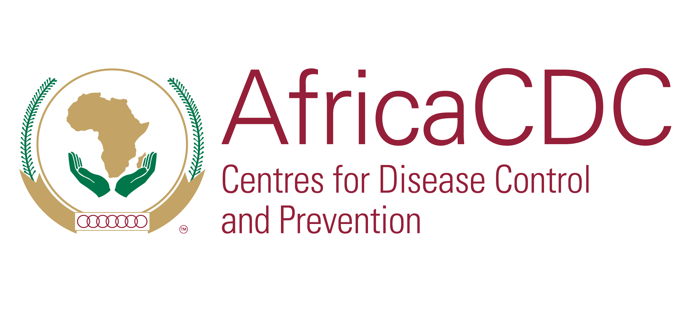
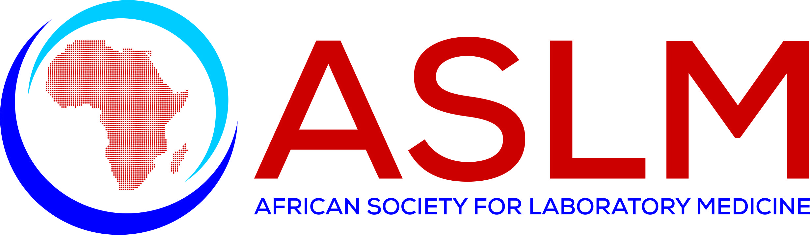
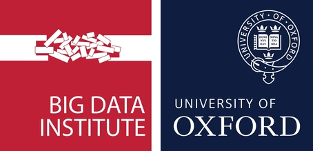

## Programme

The course is a two week programme of in-person instruction combining theoretical and practical instruction with an opportunity for hands-on practice of the skills presented.

<!-- LEAVE THIS TABLE ALONE - the rest of the page continues where it says BELOWTHETABLE -->

<table>
  <tr class="weekheader">
    <td colspan="6">
      <strong>Week 1</strong>
    </td>
  </tr>
  <tr style="border: 1px solid black;">
    <td></td>
    <th>Day 1 (Mon)</th>
    <th>Day 2 (Tue)</th>
    <th>Day 3 (Wed)</th>
    <th>Day 4 (Thu)</th>
    <th>Day 5 (Fri)</th>
  </tr>
  <tr>
    <td>09h00</td>
    <td>Welcome: What do we hope to achieve?  Speed Dating Introductions</td>
    <td>Pathogenwatch wrap-up  Talk: Introduction to data visualisation in Microreact</td>
    <td>Applications of Pathogen Genomics  Outbreak simulation workshop</td> 
    <td>Policy and datasharing  Possible Talks (1 or 2 invited speakers)</td> 
    <td>Kaptive hands on practical: review and discussion  Klebsiella virulence typing part II</td>    
  </tr>
  <tr class="break">
    <td>11h00</td>
    <td colspan="5">Tea Break (15 min)</td>
  </tr>
  <tr>
    <td>11h15</td>
    <td>Recorded talk: Practical aspects of Pathogen Genomics  Pathogenwatch introduction Pathogenwatch practical </td>
    <td>Microreact practical</td>
    <td>Outbreak simulation workshop</td>
    <td>An introdcution to Klebsiella genomics and strain typing  Klebsiella virulence typing part I</td>
    <td>Klebsiella AMR & plasmid typing  Kleborate hands on practical</td>
  </tr>
  <tr class="break">
    <td>13h00</td>
    <td colspan="5">Lunch Break</td>
  </tr>
  <tr>
    <td>14h00</td>
    <td>Pathogenwatch practical</td>
    <td>Microreact Practical & wrap-up  Recorded talk: Title TBC (Natacha Couto)</td>
    <td>Outbreak simulation workshop  Talk: Genomic surveillance of AMR using amr.watch (Julio Diaz-Caballero)</td>
    <td>Kaptive hands on practical</td>
    <td>Kleborate hands on practical</td> 
  </tr>
  <tr class="break">
    <td>15h15</td>
    <td colspan="5">Tea Break (15 min)</td>
  </tr>
  <tr>
    <td>15h30 - 16:30</td>
    <td>Talk: Genomic surveillance of K. pneumoniae in Europe</td>
    <td>Data sharing workflow mapping</td>
    <td>Data sharing workflow mapping</td>
    <td>Data sharing workflow mapping</td>
    <td>Kleborate hands on practical: review & discussion   Data sharing workflow mapping</td>

  </tr>
</table>

<table>
  <tr class="weekheader">
    <td colspan="6"><strong>Week 2</strong></td>
  </tr>
  <tr>
    <td></td>
    <th>Day 6 (Mon)</th>
    <th>Day 7 (Tue)</th>
    <th>Day 8 (Wed)</th>
    <th>Day 9 (Thu)</th>
    <th>Day 10 (Fri)</th>
  </tr>
  <tr>
    <td>09h00</td>
    <td>Introduction to CLI: hands-on  Theory: File formats, long vs short reads, raw reads QC</td>
    <td>Hands on: variant calling</td>
    <td>Cholera case study</td>
    <td>Project presentations</td>
  </tr>
  <tr class="break">
    <td>11h00</td>
    <td colspan="5">Tea Break (15 min) </td>
  </tr>
  <tr>
    <td>11h15</td>
    <td>Theory and Hands on; Conda + tool installation</td>
    <td>Hands on: phylogenetics</td>
    <td>PRACTICAL SESSION: (Trainees to work on projects)</td>
    <td>Project presentations</td>
    <td></td>
  </tr>
  <tr class="break">
    <td>13h00</td>
    <td colspan="5">Lunch Break</td>
  </tr>
  <tr>
    <td>14h00</td>
    <td>Theory and Hands on QC & alignment </td>
    <td>Hands on: phylodynamics</td>
    <td>PRACTICAL SESSION: (Trainees to work on projects)</td>
    <td>Project presentations</td>
    <td></td>
  </tr>
   <tr class="break">
    <td>15h15</td>
    <td colspan="5">Tea Break (15 min)</td>
  </tr>
  <tr>
    <td>15h30 - 16:30</td>
    <td>Theory and Hands on QC & alignment</td>
    <td>Hands on: phylodynamics</td>
    <td>PRACTICAL SESSION: (Trainees to work on projects)</td>
    <td>Project presentations</td>
    <td></td>
  </tr>
    
</table>

<!-- BELOWTHETABLE -->

## Partners

This course is a joint collaboration between [SANBI](https://www.sanbi.ac.za/) (the South African National Bioinformatics Institute) at the 
[University of the Western Cape (UWC)](https://www.uwc.ac.za/), [Africa CDC](https://africacdc.org) (the Africa Centres for Disease Control and Prevention), part of the African Union (AU), [African Society for Laboratory Medicine (ASLM)](https://aslm.org/), [London School of Hygiene and Tropical Medicine (LSHTM)](https://www.lshtm.ac.uk/) and [Big Data Institute at the University of Oxford](https://www.bdi.ox.ac.uk/)

  
  
  
  
  
  
  

